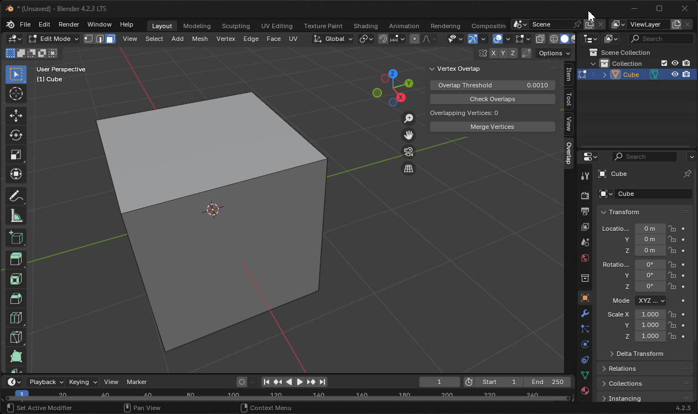

# Vertex Overlap

A Blender N-panel add-on that alerts you to overlapping vertices in real-time.

## Features

While you're in Edit mode, Vertex Overlap will:
-  Alert you to new overlapping vertices in real-time. Have you ever started, then canceled an extrusion? If you don't remember to immediately undo your last action, you will create overlapping vertices that aren't easy to spot until you start noticing weird rendering issues or you experience odd issues while editing your mesh.
- Allow you to set a custom `Overlap Threshold` distance. If you only want to be alerted about overlapping vertices of a certain distance, you can specify a custom distance. The default is 0.001m.
- Let you manually check for overlapping vertices but clicking the `Check Overlaps` button. You can click it to manually check for overlapping vertices in case you think the Overlapping Vertices count isn't updating in real-time.
- Provides a convenient `Merge Vertices` button in the N-panel that will merge overlapping vertices by the configured `Overlap Threshold` distance. This is equivalent to `Selecting All` and then `Merging by Distance`. Now in a convenient single click.
- Let you `Shift + Right-Click` on the `Overlap` N-panel and check `Pin`. This will pin Vertex Overlap to the top of your N-panel so you can always keep an eye on any overlapping vertices.

## Screenshot

Figure 1 - Small compact N-panel with an option to quickly merge any overlapping vertices.

## Video

Figure 2 - You can see the `Overlapping Vertices` field update in real-time as I cancel three different extrusions.

## Supported Blender Versions
Because Vertex Overlap is packaged as an Extension, it currently supports Blender 4.2+ and newer.

## Installation Options

### Install from Disk

Vertex Overlap is available as an extension, which you can download from the [Releases](https://github.com/shawnshipley/vertex-overlap/releases) section of its [Github](https://github.com/shawnshipley/vertex-overlap) page. Just follow the steps below to manually install:
1. Download the latest [release](https://github.com/shawnshipley/vertex-overlap/releases)
2. In Blender, go to Edit -> Preferences
3. Click on `Get Extensions`
4. Click the Extensions Settings drop-down arrow (the small arrow in the upper right corner of the window that's facing down) and select `Install from Disk`.

5. Browse to the downloaded .zip file and select it to complete the installation.

Vertex Overlap will now show up in your N-panel as `Overlap`.

### Blender Extension store
Coming soon to the Blender Extension store for an even easier install option.

### Changelog
- Added a checkbox to enable/disable real-time checking of overlapping vertices. Now you can leave real-time checking disabled, but still use the `Check Overlaps` button to manually check for overlapping vertices. Or you can enable real-time checking to be immediately alerted to overlapping vertices.
- Moved Vertex Overlap to the `Edit` N-Panel instead of its own dedicated N-Panel to reduce clutter.
- You can now select multiple objects, tab to edit mode, and Vertex Overlap will give you a count of all overlapping vertices for all objects.
- Added polling to make sure the active object is of type `MESH`.
- Removed supported platforms since the extension can be used by Windows, Linux, and Mac by default.
- Changed default merge distance to 0.0001m.