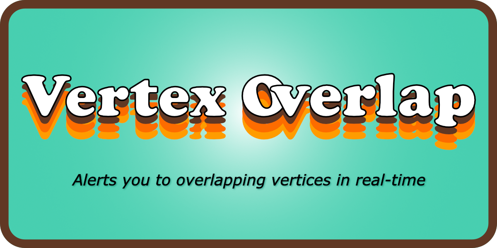
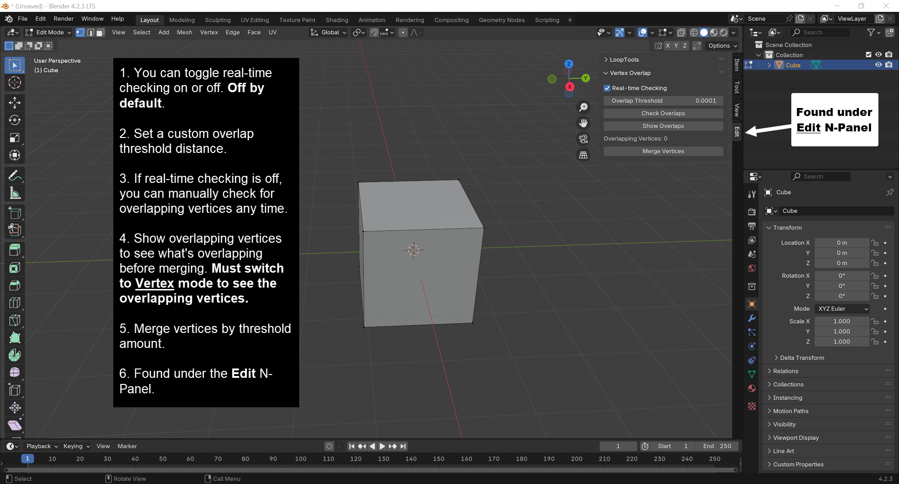
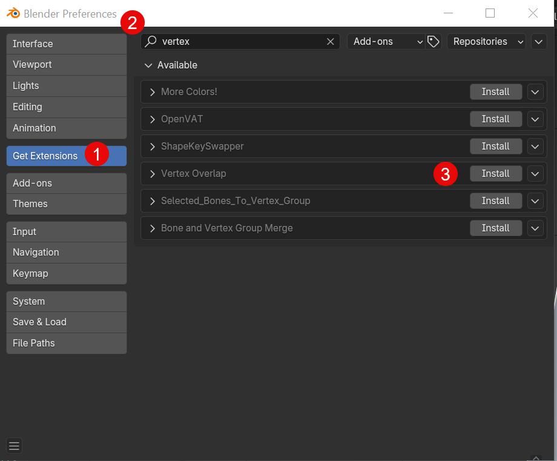
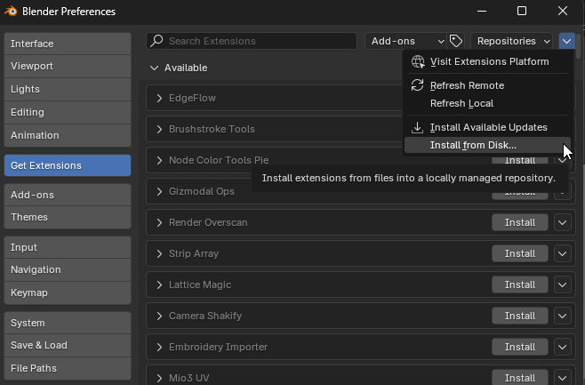

# Vertex Overlap

A Blender N-panel add-on that alerts you to overlapping vertices in real-time. Found under the `Edit` N-panel.

Have you ever started, then canceled an extrusion? If you don't remember to immediately undo your last action, you will create overlapping vertices that aren't easy to spot until you start noticing weird rendering issues or you experience odd issues while editing your mesh.
## Features

-  Alerts you to new overlapping vertices in real-time. Disabled by default, but enabled with a simple checkbox. 
- `Show Overlaps` button will highlight vertex overlaps, so you can preview what will be merged. **You must be in Vertex Selection Mode to see the highlighted overlaps**.
- You can set a custom `Overlap Threshold` distance. If you only want to be alerted about overlapping vertices of a certain distance. The default is 0.0001m.
- If real-time checking is disabled, you can manually check for overlapping vertices by clicking the `Check Overlaps` button at anytime while in Edit mode.
- Provides a convenient `Merge Vertices` button that will merge overlapping vertices by the configured `Overlap Threshold` distance. This is equivalent to `Selecting All` and then `Merging by Distance`. Now in a convenient single click.
- If you select multiple objects and tab to `Edit` mode, the `Overlapping Vertices` count will reflect the number of overlapping vertices in both mesh objects combined. If you have two objects, each with 2 overlapping vertices, and select both then tab to Edit mode, `Vertex Overlap` will show `4` total overlapping vertices.

## Screenshot

Figure 1 - Small compact N-panel with an option to quickly merge any overlapping vertices.

## Video

Figure 2 - You can see the `Overlapping Vertices` field update in real-time as I cancel three different extrusions. Then if you change to Vertex Selection mode, you can highlight which vertices are overlapping.

## Supported Blender Versions
Because Vertex Overlap is packaged as an Extension, it currently supports Blender 4.2+ and newer.

## Installation Options

### Blender Extensions Platform

Now available directly from the Blender Extensions repository.
1. In Blender, go to `Edit` -> `Preferences`
2. Click on `Get Extensions` -> Search for `Vertex Overlap` -> `Install`
3. Done!

### Install from Disk

Vertex Overlap can also be installed manually, which you can download from the [Releases](https://github.com/shawnshipley/vertex-overlap/releases) section of its [Github](https://github.com/shawnshipley/vertex-overlap) page. Just follow the steps below to install:
1. Download the latest [release](https://github.com/shawnshipley/vertex-overlap/releases)
2. In Blender, go to Edit -> Preferences
3. Click on `Get Extensions`
4. Click the Extensions Settings drop-down arrow (the small arrow in the upper right corner of the window that's facing down) and select `Install from Disk`.

5. Browse to the downloaded .zip file and select it to complete the installation.

Vertex Overlap will now show up in the `Edit` N-panel as `Vertex Overlap`.

### Changelog

#### 12/19/24 (v1.1.0)
- New `Show Overlaps` button will highlight vertex overlaps, so you can preview what will be merged. You must be in **Vertex Selection Mode** to see the highlighted vertices.

#### 12/17/24 (v1.0.8)
- Fixed overlap_threshold bug

#### 12/17/24 (v1.0.7)
- Removed 3D View tag
- Stopped registering stray properties on Scene ID

#### 12/13/24 (v1.0.6)
- Initial release to Blender Extensions platform.
- Added a checkbox to enable/disable real-time checking of overlapping vertices. Now you can leave real-time checking disabled, but still use the `Check Overlaps` button to manually check for overlapping vertices. Or you can enable real-time checking to be immediately alerted to overlapping vertices.
- Moved Vertex Overlap to the `Edit` N-Panel instead of its own dedicated N-Panel to reduce clutter.
- You can now select multiple objects, tab to edit mode, and Vertex Overlap will give you a count of all overlapping vertices for all objects.
- Added polling to make sure the active object is of type `MESH`.
- Removed supported platforms since the extension can be used by Windows, Linux, and Mac by default.
- Changed default merge distance to 0.0001m.